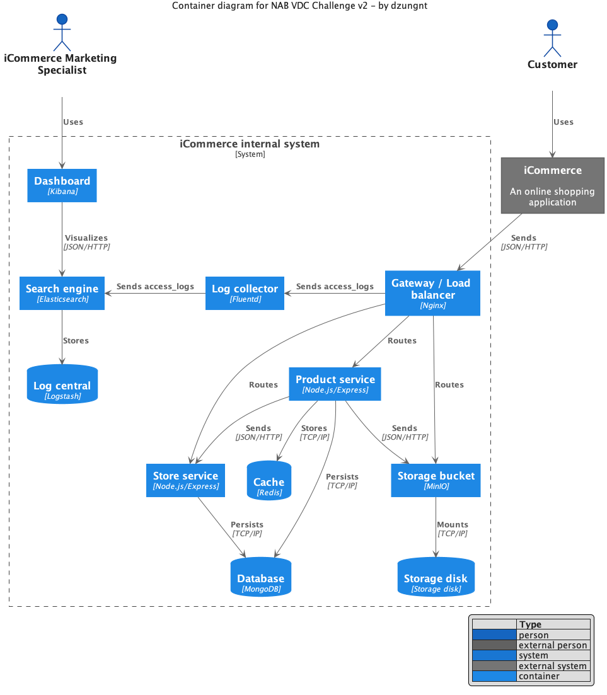
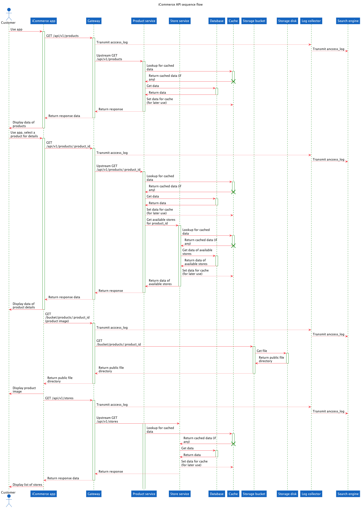
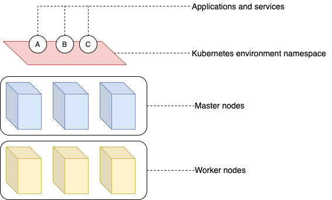

# Submission to NAB VDC NodeJS Development Challenge V2 - by dzungnt

## Overview of system architecture

in which, we can determine our actors are:

- Customer: is the guests and potential end-users who access to iCommerce app
- iCommerce Marketing Specialist: who is an iCommerce staff, specialty in Digital Marketing and Analysis; this person would use internal setup of ELK (Elasticsearch-Kibana-Logstash) to analyze incomming requests from iCommerce app to the server.

About the system, we would have following components:

- Gateway: I would choose Nginx for its simplicity, with strong configuration as well as loggings (we would need it for data analysis with ELK & Fluentd)
- Log collector: The choice is Fluentd, simply a log collector, accesses to Nginx's output access_log files. This part transmits accessing logs to Elasticsearch for logging, tracing. These data can be useful with Kibana to visualize them up.
- ELK: Like I mentioned, in order to support Marketing department analyzing the incoming requests interacting with iCommerce front-end app, this stack is simple and powerful to play with.
- Store service: a RESTful API service, with Express framework; returns data of stores and their addresses.
- Product service: also a RESTful API service, by Express; returns data of products and their details. This also consumes some API from store service above to query for available stores can sell a certain product.
- Database: MongoDB is my choice with its No-SQL structure. The point is at the first (rush) version of iCommerce statement, we would not know how this can evolve. SQL is too structure and has too many constraints. A flexible of data object document is an advance. Alternative to MongoDB is Couchbase.
- Cache: Redis. Because the API services can be access publicly by anonymous guest using iCommerce app. Some requests may be consumed repeatedly based on the same query API request input. So that, in order to reduce repeating requests at certain time duration, a cache should be integrated with Store & Product services to re-use data, avoid querying to database everytime.
- Storage bucket & Storage disk: A product, besides its metadata and details, we would probably display its image to the customers. In case lacking of cloud services like Google bucket or any restricted DNS that we may never can use, I suggest MinIO in this system. MinIO is the open-source of Amazon S3, but free and ease-to-integrate. MinIO would need a mount volume in order to storage file and image. It can easily set 'download' policy for public use. The image URL must be imported into the database (manually, or a future back-office application for admin to upload them in)

## Sequence flows

## Deployment

- For deployment, me personally fond of Kubernetes. It is a great orchestration platform to deploy applications with amazing scalibility and configuration. 

### References

This submission of mine was supported with xuanye's C4 model &  be Diagram-as-code for easy for everyone in the project to contribute and keep the consistency among the product development growth path.
